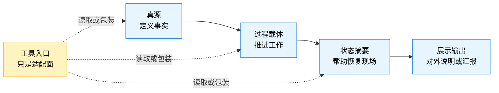
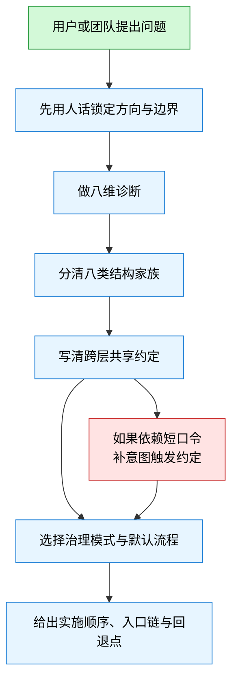
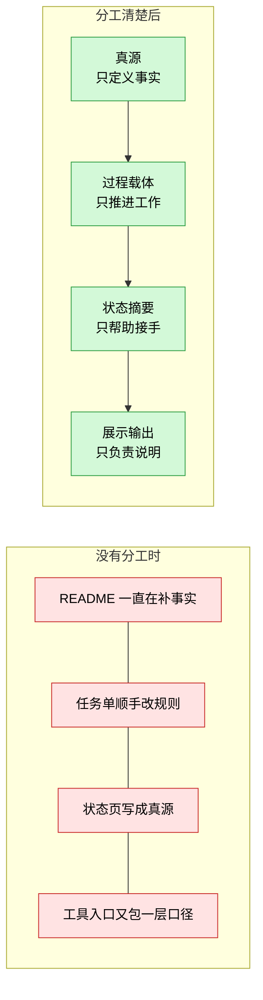

# 文档驱动的项目治理（files-driven）

当前版本：`v0.2.7`

> 如果只用一句话解释：`files-driven` 不是帮你把目录摆整齐，而是帮你把项目里的“事实、过程、状态、展示”分开，让 README、任务单、状态页、工具入口和代理说明不再互相改口径。

这个仓库面向的是 AI Agent 项目、AI 驱动流程项目，以及一类已经明显依赖文档、状态页、工作记录和多工具入口来协作的项目。
它关心的不是“文档多不多”，而是“哪些文档在定义事实，哪些文档只是推进工作，哪些文档只是方便接手，哪些文档只是对外说明”。

很多项目一开始都不是死在代码上，而是死在这类问题上：

- README 最常被打开，所以慢慢被当成真源
- 任务单里顺手补了规则，但没人知道要不要回写
- 状态页写出了上游没有确认的新事实
- 不同工具各自包了一层入口文档，口径越包越不一致
- 人一换、代理一换、上下文一断，项目就得靠猜恢复

这就是 `files-driven` 想处理的事。

## 先判断你是不是在找这个

如果你遇到的是下面这些问题，这个项目大概率有用：

- 你已经有不少文档，但它们开始互相漂移
- 你想让多人、多代理、多工具协作时还能共享同一套事实
- 你准备做治理，但不想一上来就上很重的流程
- 你希望短口令能稳定驱动工作，例如“继续开发”“开始审计”“推进”
- 你需要一个能交接、能恢复、能回退的文档体系

如果你现在只是想：

- 写一个更好看的目录树
- 给单人一次性小脚本项目补个简单 README
- 做纯展示型 landing page 文案

那这个项目大概率太重了，不必硬上。

## README、SKILL 和 references 分别是干什么的

这件事很重要。
你提到“不是把给 LLM 理解的 md 放到 README 里就行”，这判断是对的。
这个仓库里不同文档，本来就不该承担同一种职责。

| 文件 | 主要读者 | 主要回答什么 | 不该承担什么 |
| --- | --- | --- | --- |
| `README.md` | 第一次接触这个项目的人 | 这项目在解决什么、什么时候该用、怎么开始、值不值得继续读 | 不能写成只给代理执行的硬规则清单 |
| `SKILL.md` | 会执行这个技能的代理 | 工作流、边界、步骤、输出约束、默认判断规则 | 不该承担对外的项目介绍职责 |
| `references/*.md` | 需要深入某一块的人 | 某个专题的稳定参考，例如输出约定、读取顺序、共享约定 | 不该承担第一次上手入口 |
| `docs/*.md` | 想看版本补强、完整背景的人 | 完整说明、版本说明、语言规范、专题记录 | 不该替代 README 成为默认入口 |

换句话说：

- `README` 应该让人先读懂“这是什么、有什么用、值不值得继续看”
- `SKILL` 应该让代理知道“该怎么做、先做什么、不能越过什么边界”
- `references` 应该是“用到哪块，再下钻哪块”

## 先看一张图：这个项目到底在分什么

项目里的文档，不应该都做同一件事。
`files-driven` 默认先把它们按职责拆开。



这张图的意思很简单：

- 真源负责定义事实，不能谁都改
- 过程载体负责推进当前工作，不该偷偷升级成真源
- 状态摘要负责帮助别人快速接手，不该比真源知道得更多
- 展示输出负责说明，不该私自决定项目边界
- 工具入口只是适配面，不能因为它最顺手，就把它当成项目事实中心

## 这个技能到底怎么推进一次治理工作

它不是一上来就发术语表，也不是上来先画目录树。
默认顺序是先把事说清，再把结构分清。



这条流程背后其实只有几个很朴素的判断：

1. 边界没锁定前，不要急着谈架构和目录
2. 没分清真源和摘要页前，不要急着说“这里应该放在哪个文件夹”
3. 没判断协作密度、恢复压力和工具异构度前，不要急着上重治理
4. 如果团队真想用短口令驱动工作，就得把语义写清楚，而不是靠聊天默契

## 一个更具体的例子

很多项目不是没有文档，而是每份文档都在偷偷做多份工作。
下面这个对比，就是 `files-driven` 最常处理的情况。



举个更贴近现实的例子：

假设你有一个多代理仓库，里面已经有 `README`、任务页、状态页、代理入口说明和几份规则文档。
一开始大家都只想“先跑起来”，于是：

- README 为了方便，补了不少临时事实
- 任务页为了省事，顺手定义了新规则
- 状态页为了好接手，写进了还没确认的新边界
- 不同工具各自维护一份入口说明，越写越像项目总入口

等到项目要交接、恢复、审计或者扩人时，问题就一起爆出来了：

- 到底哪个文件算准
- 新人该先读什么
- 代理能直接改哪些东西
- 哪些文档只是摘要，哪些文档真的能改事实

`files-driven` 做的事，就是先把这张责任图重新画清楚，再决定哪些流程该默认启用，哪些先不要加。

## 这项目不是在教你背术语，而是在解决这些实际问题

### 1. 它先让人把需求说清楚

这个项目不会默认用户已经把边界讲清楚了。
如果方向还在漂移，默认先问：

- 第一批真正会用的人是谁
- 这次第一阶段到底交付什么
- 做好以后，最想看到什么具体变化
- 哪些东西虽然相关，但这次明确不做
- 谁来判断这次算不算达标

也就是说，它先处理“这次到底要做什么”，再处理“文档该怎么长”。

### 2. 它先分清结构，再谈目录

很多项目喜欢一上来就讨论：

- 要不要加 `specs/`
- 要不要拆 `agents/`
- 要不要把状态页搬到 `docs/`

但如果你还没分清哪些东西是真源、哪些只是过程载体，这些讨论很容易变成无效重排。

### 3. 它默认考虑交接和恢复

这个项目不是只考虑“现在看起来清楚不清楚”，还会考虑：

- 人换了以后，能不能快速接手
- 代理上下文断了以后，能不能恢复现场
- 工具换了以后，事实会不会丢
- 项目漂移以后，有没有一条能回退的恢复链

### 4. 它允许治理有轻有重

它不是默认让每个项目都走全套流程。
相反，它会先看：

- 变更风险高不高
- 协作密度大不大
- 自动化和代理自主度高不高
- 读取成本和文档膨胀严不严重

然后才决定是更偏轻量治理，还是更偏受控交付。

## 核心概念，用人话解释

下面这些词，是这个项目反复会用到的核心词。
它们看起来像术语，但本质上都是在回答很具体的问题。

| 概念 | 讲人话是什么 | 为什么重要 |
| --- | --- | --- |
| 真源 | 真正定义事实、边界、规则的上游文档 | 不先认出真源，后面的同步和交接都会乱 |
| 当前版本锚点 | 现在应该以哪一版为准 | 项目一旦有多版并存，没有锚点就会读错 |
| 官方读取顺序 | 新人或代理应该先看什么、后看什么 | 读取顺序不稳定，交接成本就会飙升 |
| 工具适配入口 | 某个工具为了接入项目做的包装面 | 它应该方便使用，但不该冒充真源 |
| 跨层共享约定 | 谁能写、谁只能读、谁负责同步 | 多人多代理并行时，这是防漂移的关键 |
| 意图触发约定 | “继续开发”“开始审计”这类短口令的稳定含义 | 不写清楚，短口令很快就会工具化漂移 |

### 八类结构家族

这个仓库默认把项目里的关键结构分成八类。
不是为了把模型做得复杂，而是为了避免职责混淆。

| 结构家族 | 它主要管什么 | 常见误用 |
| --- | --- | --- |
| 规则与约束层 `policy_or_rules` | 项目的规则、边界、纪律、约束 | 被散落到 README、任务页、聊天记录里 |
| 对象层 `object` | 项目里稳定存在的对象及其状态语义 | 被临时任务文档抢着定义 |
| 流程层 `workflow` | 工作是怎么流转、在哪些点复核或回退 | 被角色说明或工具说明替代 |
| 技能层 `skill` | 可复用的做法、步骤和适用边界 | 被写成组织角色或项目总说明 |
| 角色层 `agent` | 谁负责什么、谁有权限、谁站在哪个控制位置 | 被工具名直接顶替 |
| 过程载体层 `execution_object` | 任务、讨论、决策、复核、交接这些工作载体 | 被悄悄升级成长期真源 |
| 状态摘要层 `status_projection` | 帮助快速恢复现场的摘要视图 | 写出了上游没确认的新事实 |
| 展示输出层 `display_projection` | 对外说明、汇报、展示 | 因为最常被看而反过来定义边界 |

## 你最终会从这个技能里得到什么

默认情况下，这个技能不会一上来就吐一大堆重文档。
它优先给你一套能落地、能交接、能继续推进的治理结果。

通常至少会包含：

1. 方向与边界锚点
2. 项目画像和主要风险
3. 主要漂移点或失真点
4. 推荐治理模式
5. 推荐默认流程和条件流程
6. 结构家族划分
7. 真源、入口和恢复链
8. 实施顺序
9. 不建议现在就做的事

如果项目确实更复杂，还会继续补：

- 跨层共享矩阵
- 角色控制回路
- 当前版本锚点与读取顺序
- 意图触发约定
- 文档生命周期与压缩策略

## 第一次怎么用它

如果你只是第一次尝试，不必把整个仓库读完。
直接像下面这样开口就够了：

- “帮我看这个仓库里哪些文档是真源，哪些只是状态摘要。”
- “这个项目已经开始漂移了，请先给我一个止血顺序。”
- “我想搭一个早期够用的 AI Agent 项目结构，先帮我锁定边界。”
- “我们想用‘继续开发’和‘开始审计’这种短口令驱动工作，帮我做成稳定约定。”

如果项目边界还不稳，推荐先读：

- [references/起步阶段_故事与测试对齐.md](references/起步阶段_故事与测试对齐.md)
- [references/说人话需求确认工具包.md](references/说人话需求确认工具包.md)

如果你已经知道项目有漂移问题，推荐先读：

- [references/场景手册.md](references/场景手册.md)
- [references/基本原则.md](references/基本原则.md)

如果你已经在处理多工具、多代理协作，推荐先读：

- [references/跨层共享约定.md](references/跨层共享约定.md)
- [references/工具适配对照表.md](references/工具适配对照表.md)
- [references/意图触发约定.md](references/意图触发约定.md)

## 阅读路线

### 如果你是第一次接触这个仓库

建议按下面顺序读：

1. [README.md](README.md)
2. [SKILL.md](SKILL.md)
3. [docs/完整说明书.md](docs/完整说明书.md)
4. [references/场景手册.md](references/场景手册.md)

### 如果你是来真正落地治理的

建议按下面顺序读：

1. [SKILL.md](SKILL.md)
2. [references/输出约定.md](references/输出约定.md)
3. [references/治理模式选择对照表.md](references/治理模式选择对照表.md)
4. [references/经典治理流程库.md](references/经典治理流程库.md)
5. [references/跨层共享约定.md](references/跨层共享约定.md)

### 如果你只想看语言和写法标准

先读：

1. [docs/语言体系规范.md](docs/语言体系规范.md)
2. [references/说人话需求确认工具包.md](references/说人话需求确认工具包.md)

## 版本演进：这几版到底在补什么

你提到想把 changelog 的工作放回 README，这里就直接把版本演进讲成人话。
不是只列“新增了哪些文件”，而是说明“每一版到底在补哪个缺口”。

| 版本 | 这版主要补了什么 | 它想解决的实际问题 |
| --- | --- | --- |
| `v0.1.0` | 首次公开发布 | 先把“文档治理不是目录整理”这件事立住，给出基础参考件 |
| `v0.2.0` | 正式把流程库纳入技能 | 只会分结构不够，项目还需要知道日常怎么推进、怎么复核、怎么回退 |
| `v0.2.1` | 补齐结构家族、读取顺序和工具适配 | 解决“入口很多、包装很多，但没人知道该先读哪份、哪份才算准”的问题 |
| `v0.2.2` | 加入理解把握度与澄清规则 | 避免在边界没搞清时就硬给治理方案 |
| `v0.2.3` | 调整为“核心必答 + 条件展开” | 防止输出越来越厚，读者每次都被完整蓝图压住 |
| `v0.2.4` | 引入文档生命周期与压缩治理 | 解决文档越写越多、活跃页面和历史页面混在一起的问题 |
| `v0.2.5` | 把方向与边界锚点前置 | 解决“还没说清第一阶段做什么，就开始设计结构”的问题 |
| `v0.2.6` | 增加说人话需求确认工具包 | 让需求确认不再只靠黑话和抽象问法，而是能直接起草故事和测试 |
| `v0.2.7` | 增加意图触发约定 | 解决短口令在不同工具里含义越用越飘的问题 |

如果你想看每一版对应的详细背景，再继续读：

- [docs/v0.2.0_版本说明.md](docs/v0.2.0_版本说明.md)
- [docs/v0.2.1_版本说明.md](docs/v0.2.1_版本说明.md)
- [docs/v0.2.2_版本说明.md](docs/v0.2.2_版本说明.md)
- [docs/v0.2.3_版本说明.md](docs/v0.2.3_版本说明.md)
- [docs/v0.2.4_版本说明.md](docs/v0.2.4_版本说明.md)
- [docs/v0.2.5_版本说明.md](docs/v0.2.5_版本说明.md)
- [docs/v0.2.6_版本说明.md](docs/v0.2.6_版本说明.md)
- [docs/v0.2.7_版本说明.md](docs/v0.2.7_版本说明.md)

## 仓库结构

```text
.
├── README.md
├── SKILL.md
├── CHANGELOG.md
├── CONTRIBUTING.md
├── SECURITY.md
├── agents/
│   └── openai.yaml
├── docs/
│   ├── 完整说明书.md
│   ├── 语言体系规范.md
│   ├── 仓库元数据建议.md
│   ├── GitHub上传清单.md
│   └── v*_版本说明.md
└── references/
    ├── 基本原则.md
    ├── 场景手册.md
    ├── 输出约定.md
    ├── 治理模式选择对照表.md
    ├── 经典治理流程库.md
    ├── 结构家族定位约定.md
    ├── 官方读取顺序.md
    ├── 工具适配对照表.md
    ├── 跨层共享约定.md
    ├── 理解把握度与澄清规则.md
    ├── 起步阶段_故事与测试对齐.md
    ├── 说人话需求确认工具包.md
    ├── 文档生命周期与压缩.md
    └── 意图触发约定.md
```

其中最值得记住的是：

- `README.md` 是给人读的入口
- `SKILL.md` 是给代理执行的主体
- `references/` 放的是可以单独下钻的稳定专题
- `docs/` 放的是完整背景和版本说明

## 贡献与安全

- 贡献方式见 [CONTRIBUTING.md](CONTRIBUTING.md)
- 安全问题见 [SECURITY.md](SECURITY.md)

## 许可证

当前许可证为 [LICENSE](LICENSE) 中定义的 `MIT`。
