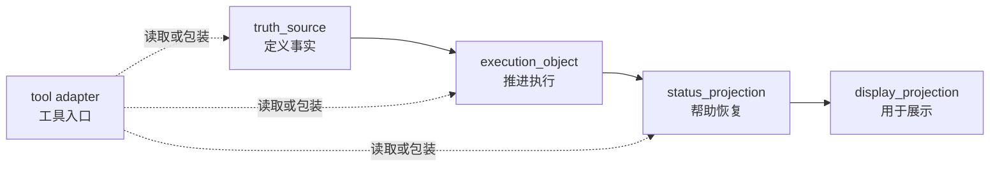

# 文档驱动的项目治理（files-driven）

当前公开版本：`v0.2.7`<br>
未发布中的整理与修正见 [CHANGELOG.md](CHANGELOG.md) 的 `Unreleased`。

> `files-driven` 不是帮项目“摆目录”，而是帮项目分清：哪些文件定义事实，哪些文件推进执行，哪些文件只做状态摘要或展示。

这个仓库面向 AI、多代理和文档密集项目。
它关心的不是“文档多不多”，而是：

- 真源到底在哪里
- 哪些页面只是过程载体、状态摘要或展示投影
- 多人、多代理、多工具并行时谁先读、谁能写、谁负责复核
- 项目漂移以后如何止血、恢复和回退

## 这不是模板，而是方法学

`files-driven` 不是一个“推荐目录结构”，也不是某一种流程宗派的外壳。
它更接近一种项目治理的方法学语言：

- 用什么来定义事实
- 用什么来推进执行
- 用什么来帮助接手和恢复
- 用什么来对外展示
- 谁能修改，谁只能投影，谁负责复核，谁能回退

所以它提供的不是一条固定答案，而是一套判断框架。
它教你的不是“这个项目应该长成哪一个样子”，
而是“面对不同项目、不同风险、不同协作形态时，应该怎样判断什么该稳定、什么该流动、什么该收紧、什么该保持轻量”。

换句话说，这个仓库更接近“渔”，不是“鱼”。

## 这套方法从哪里来

`files-driven` 不是从某一个单一理论直接搬来的。
它来自多年在不同理论和实践中的沉淀、碰撞和重组，
尤其吸收了下面几类传统：

| 来源 | 原本强调什么 | 在 `files-driven` 里的转写 |
| --- | --- | --- |
| `Spec-Driven` | 边界、规格、验收、慢变量 | 真源、对象边界、验收锚点、版本清晰度 |
| `Kanban` | 流动、可见性、在制品、交接 | 过程载体、状态摘要、恢复入口、队列与责任面 |
| `Agile / Sprint-like` | 反馈、阶段收敛、里程碑复核 | 决策包、复核关口、阶段性整合、回退与改进 |
| 系统论 | 结构、层次、边界、耦合 | 结构家族、四层分层、责任模型、慢快变量拆分 |
| 信息论 | 来源、传输、失真、压缩 | 真源、投影、读取顺序、版本锚点、恢复成本 |
| 控制论 | 观察、决策、执行、反馈、纠偏 | `observe -> decide -> act -> review -> rollback_or_improve` |

这几类传统在这里不是并列摆放的口号，而是被重新组织成一套统一语言。
`files-driven` 的目标，不是让项目“看起来像规格驱动”或“看起来像敏捷”，
而是回答一个更根本的问题：

**在一个由人、代理、工具、文档和流程共同组成的项目里，事实如何稳定，执行如何推进，失真如何被发现，秩序如何被恢复。**

## 与 Prompt / Context / Harness 演化线的关系

除了更早的项目治理传统，`files-driven` 也与近年的 AI 工程方法演化有关。
如果把这条外部演化线压缩来看，大致可以分成三步：

1. `Prompt Engineering`
   - 重点放在单次提示词怎么写、角色怎么设、示例怎么给
   - 主要优化的是单回合输出质量
2. `Context Engineering`
   - 重点转向上下文如何组织，包括检索、记忆、状态、工具入口和历史材料
   - 主要优化的是多回合、多步骤任务里的上下文供给质量
3. `Harness / Agent-Native Engineering`
   - 重点进一步转向代理运行底座，包括上下文装配、验证入口、恢复链、监督界面和回退机制
   - 主要优化的是代理在真实项目环境中的可控性、可恢复性和交付稳定性

`files-driven` 与这条演化线是相通的，但不是从它们直接派生出来的。
更准确地说，它是在多年项目实践和更早的治理理论基础上，
对这条演化线做出的本地重述：

- 当外界还在谈 `prompt` 时，它更关心提示词背后的事实真源和边界来源
- 当外界开始谈 `context` 时，它更关心上下文的结构、分层、读取顺序和失真成本
- 当外界开始谈 `harness` 时，它更关心把这些问题真正落到项目文档、过程载体、状态投影和控制回路里

所以这条演化线对本项目的意义，不是提供根源，
而是提供一个很好的参照系：
它帮助解释为什么今天的项目治理，已经不能只停留在“写好 prompt”或“堆好资料”，
而必须进一步回答代理怎么接手、怎么验证、怎么恢复、怎么被监督、怎么在多人多工具环境下保持同一套事实。

## 这套方法的原创重点在哪里

这套方法的重点不在发明新名词，而在把原本分散在不同理论里的治理要点，压成了可以直接落到仓库和协作中的判断语言。

它至少做了这几件事：

1. 把文档从“被动说明”提升为“治理载体”
2. 把项目材料稳定拆成结构家族，而不是只按目录名或文件外观理解
3. 把文档系统稳定拆成真源、过程、摘要、展示四层
4. 把多主体协作中的问题转写成信息流、责任边界和控制回路问题
5. 把 `Spec / Kanban / Agile` 从彼此竞争的标签，重组为可按项目特征组合的治理资源

所以 `files-driven` 不要求你先认同某个理论门派。
它要求的是：面对一个真实项目，能否把边界、事实、流动、反馈和恢复说清楚。

## 它在教什么判断

如果把这套方法再压缩一层，它主要在教五种判断：

1. 什么应该成为慢变量，进入稳定真源
2. 什么应该保持流动，留在过程载体
3. 什么只能总结，不能反写上游
4. 什么需要正式关口，什么保持轻量回路
5. 当项目开始漂移时，应该先止血哪里，再恢复哪里

这也是为什么它既能吸收规格驱动、看板流和敏捷节奏，
又不直接退化成其中任何一种固定模板。

## 什么时候该用

- 仓库里已经有不少规则页、任务页、状态页和入口文档，但它们开始互相漂移
- 你要让多人、多代理、多工具协作时还能共享同一套事实
- 你准备做治理，但不想一上来就堆很重的流程
- 你希望“继续开发”“开始审计”“推进”这类短口令能稳定跨工具复用
- 你需要一套能交接、能恢复、能回退的文档结构
- 你的项目反复出现“还没审完就想修改”“明明 `blocked` 了还继续往下走”这类 gate 失效

## 什么时候不该用

- 你只是在做一次性的小脚本或单人短任务
- 你现在只是想补一个简单 README，而不是治理一套协作结构
- 你的项目几乎没有状态页、过程页和工具入口，也没有明显恢复压力

## 它在解决什么问题

很多项目不是死在代码上，而是死在这些地方：

- README 因为最常被打开，慢慢变成真源
- 任务单或讨论页顺手改了规则，但没人回写上游
- 状态页为了方便接手，写出了上游没确认的新事实
- 工具入口各自包了一层口径，越包越不一致
- 人换了、代理换了、上下文断了以后，项目只能靠猜恢复
- 明明已经说了 `partial / blocked`，但下一步还是提前滑进修改、发布或放行

`files-driven` 的作用，就是先把这张责任图重新画清，再决定该启用哪些治理动作。
如果问题重心已经是 gate 不严，
仓库里现在也提供了一条专门的稳定解入口：
[references/关口硬化与稳定放行.md](references/关口硬化与稳定放行.md)。

## 理论基点

这套方法学在执行时，默认同时从三个基点看项目：

### 1. 系统基点

先判断边界、层次、结构家族、慢快变量和责任面。
也就是先回答“系统怎么分层”，再回答“目录怎么摆”。

### 2. 信息基点

再判断一个事实从哪里产生、如何传播、在哪里被压缩、在哪里被投影。
也就是先回答“信息怎么流动和失真”，再回答“文档怎么写得漂亮”。

### 3. 控制基点

最后判断谁观察、谁决策、谁执行、谁复核、谁能回退。
也就是先回答“秩序如何被维持和恢复”，再回答“流程叫什么名字”。

`files-driven` 的很多独特性，正是来自这三个基点的同时使用。
它不是先选一个流程名字，再去配文档；
而是先看系统、信息和控制问题，再反推出该用哪些治理动作。

## 核心模型

默认先把文档系统按四层看清：



四层分别回答：

- `truth_source`：哪份材料在定义事实、规则、边界
- `execution_object`：哪份材料在推进任务、讨论、决策、复核、交接
- `status_projection`：哪份材料在帮人快速恢复现场
- `display_projection`：哪份材料只负责说明、汇报或对外展示

再往下，技能会在八类结构家族里定位职责：

- `policy_or_rules`
- `object`
- `workflow`
- `skill`
- `agent`
- `execution_object`
- `status_projection`
- `display_projection`

详细判断规则见 [SKILL.md](SKILL.md)。

## 这个仓库里各文件负责什么

| 文件 | 主要读者 | 主要职责 |
| --- | --- | --- |
| [README.md](README.md) | 第一次接触这个项目的人 | 解释这是什么、什么时候该用、怎么开始 |
| [SKILL.md](SKILL.md) | 会执行这个技能的代理 | 给出主流程、判断规则、边界约束和参考件路由 |
| [references/](references/) | 需要深入某一专题的人或代理 | 承载输出约定、流程库、读取顺序、共享约定等稳定参考 |
| [docs/](docs/) | 想看完整背景、版本说明和公开专题材料的人 | 承载说明书、版本说明和公开专题记录 |
| [CHANGELOG.md](CHANGELOG.md) | 关心仓库变更账本的人 | 记录仓库层面的新增、调整和删除 |

一句话区分：

- `README` 是入口
- `SKILL` 是执行导览
- `references` 是按需下钻
- `docs` 是背景与公开说明
- `CHANGELOG` 是账本

## 第一次怎么开始

如果你是人在判断要不要用这套方法，先按这个顺序读：

1. [README.md](README.md)
2. [SKILL.md](SKILL.md)
3. [docs/完整说明书.md](docs/完整说明书.md)

如果你已经确定要落地治理，优先按问题下钻：

- 边界还不稳：读 [references/起步阶段_故事与测试对齐.md](references/起步阶段_故事与测试对齐.md)、[references/说人话需求确认工具包.md](references/说人话需求确认工具包.md)
- 仓库已经漂移或需要恢复：读 [references/场景手册.md](references/场景手册.md)、[references/基本原则.md](references/基本原则.md)
- 多工具、多代理共享同一事实：读 [references/跨层共享约定.md](references/跨层共享约定.md)、[references/工具适配对照表.md](references/工具适配对照表.md)
- 希望用短口令推进工作：读 [references/意图触发约定.md](references/意图触发约定.md)
- 需要正式输出治理方案：读 [references/输出约定.md](references/输出约定.md)

## 常见开口方式

第一次使用时，不必把整个仓库讲成论文。像下面这样开口就够了：

- “帮我判断这个仓库里哪些文件是真源，哪些只是状态摘要。”
- “这个项目已经开始漂移了，请先给我一个止血顺序。”
- “我要搭一个 AI Agent 驱动的新项目，先帮我锁方向与边界。”
- “我们想用‘继续开发’和‘开始审计’这类短口令驱动工作，帮我做成稳定约定。”

## 阅读路线

如果你是代理并且要真正执行这个技能，默认顺序是：

1. [SKILL.md](SKILL.md)
2. [references/输出约定.md](references/输出约定.md)
3. 按当前问题去读对应 reference

如果你只想理解语言和写法标准，先读：

1. [docs/语言体系规范.md](docs/语言体系规范.md)
2. [references/说人话需求确认工具包.md](references/说人话需求确认工具包.md)

## 仓库结构

```text
.
├── README.md
├── SKILL.md
├── CHANGELOG.md
├── agents/
│   └── openai.yaml
├── docs/
│   ├── 完整说明书.md
│   ├── 语言体系规范.md
│   └── v*_版本说明.md
└── references/
    ├── 输出约定.md
    ├── 经典治理流程库.md
    ├── 场景手册.md
    ├── 基本原则.md
    ├── 治理模式选择对照表.md
    ├── 结构家族定位约定.md
    ├── 官方读取顺序.md
    ├── 工具适配对照表.md
    ├── 跨层共享约定.md
    ├── 起步阶段_故事与测试对齐.md
    ├── 说人话需求确认工具包.md
    ├── 文档生命周期与压缩.md
    └── 意图触发约定.md
```

## 版本与变更

- 当前公开版本是 `v0.2.7`
- 未发布中的整理与修正统一记在 [CHANGELOG.md](CHANGELOG.md) 的 `Unreleased`
- 每一版为什么重要、改变了什么理解或用法，读 [docs/](docs/) 里的 `v*_版本说明.md`
- 研究过程留痕、任务计划、进度账本和内部案例默认留在本地忽略区，不进入公开仓库

## 贡献与安全

- 贡献方式见 [CONTRIBUTING.md](CONTRIBUTING.md)
- 安全问题见 [SECURITY.md](SECURITY.md)

## 许可证

当前许可证见 [LICENSE](LICENSE)，为 `MIT`。
