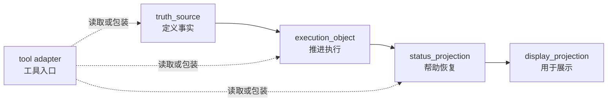

# 文档驱动的项目治理（files-driven）

当前公开版本：`v0.2.7`<br>
未发布中的整理与修正见 [CHANGELOG.md](CHANGELOG.md) 的 `Unreleased`。

> `files-driven` 不是帮项目“摆目录”，而是帮项目分清：哪些文件定义事实，哪些文件推进执行，哪些文件只做状态摘要或展示。

这个仓库面向 AI、多代理和文档密集项目。
它关心的不是“文档多不多”，而是：

- 真源到底在哪里
- 哪些页面只是过程载体、状态摘要或展示投影
- 多人、多代理、多工具并行时谁先读、谁能写、谁负责复核
- 项目漂移以后如何止血、恢复和回退

## 什么时候该用

- 仓库里已经有不少规则页、任务页、状态页和入口文档，但它们开始互相漂移
- 你要让多人、多代理、多工具协作时还能共享同一套事实
- 你准备做治理，但不想一上来就堆很重的流程
- 你希望“继续开发”“开始审计”“推进”这类短口令能稳定跨工具复用
- 你需要一套能交接、能恢复、能回退的文档结构

## 什么时候不该用

- 你只是在做一次性的小脚本或单人短任务
- 你现在只是想补一个简单 README，而不是治理一套协作结构
- 你的项目几乎没有状态页、过程页和工具入口，也没有明显恢复压力

## 它在解决什么问题

很多项目不是死在代码上，而是死在这些地方：

- README 因为最常被打开，慢慢变成真源
- 任务单或讨论页顺手改了规则，但没人回写上游
- 状态页为了方便接手，写出了上游没确认的新事实
- 工具入口各自包了一层口径，越包越不一致
- 人换了、代理换了、上下文断了以后，项目只能靠猜恢复

`files-driven` 的作用，就是先把这张责任图重新画清，再决定该启用哪些治理动作。

## 核心模型

默认先把文档系统按四层看清：



四层分别回答：

- `truth_source`：哪份材料在定义事实、规则、边界
- `execution_object`：哪份材料在推进任务、讨论、决策、复核、交接
- `status_projection`：哪份材料在帮人快速恢复现场
- `display_projection`：哪份材料只负责说明、汇报或对外展示

再往下，技能会在八类结构家族里定位职责：

- `policy_or_rules`
- `object`
- `workflow`
- `skill`
- `agent`
- `execution_object`
- `status_projection`
- `display_projection`

详细判断规则见 [SKILL.md](SKILL.md)。

## 这个仓库里各文件负责什么

| 文件 | 主要读者 | 主要职责 |
| --- | --- | --- |
| [README.md](README.md) | 第一次接触这个项目的人 | 解释这是什么、什么时候该用、怎么开始 |
| [SKILL.md](SKILL.md) | 会执行这个技能的代理 | 给出主流程、判断规则、边界约束和参考件路由 |
| [references/](references/) | 需要深入某一专题的人或代理 | 承载输出约定、流程库、读取顺序、共享约定等稳定参考 |
| [docs/](docs/) | 想看完整背景、版本说明和公开专题材料的人 | 承载说明书、版本说明和公开专题记录 |
| [CHANGELOG.md](CHANGELOG.md) | 关心仓库变更账本的人 | 记录仓库层面的新增、调整和删除 |

一句话区分：

- `README` 是入口
- `SKILL` 是执行导览
- `references` 是按需下钻
- `docs` 是背景与公开说明
- `CHANGELOG` 是账本

## 第一次怎么开始

如果你是人在判断要不要用这套方法，先按这个顺序读：

1. [README.md](README.md)
2. [SKILL.md](SKILL.md)
3. [docs/完整说明书.md](docs/完整说明书.md)

如果你已经确定要落地治理，优先按问题下钻：

- 边界还不稳：读 [references/起步阶段_故事与测试对齐.md](references/起步阶段_故事与测试对齐.md)、[references/说人话需求确认工具包.md](references/说人话需求确认工具包.md)
- 仓库已经漂移或需要恢复：读 [references/场景手册.md](references/场景手册.md)、[references/基本原则.md](references/基本原则.md)
- 多工具、多代理共享同一事实：读 [references/跨层共享约定.md](references/跨层共享约定.md)、[references/工具适配对照表.md](references/工具适配对照表.md)
- 希望用短口令推进工作：读 [references/意图触发约定.md](references/意图触发约定.md)
- 需要正式输出治理方案：读 [references/输出约定.md](references/输出约定.md)

## 常见开口方式

第一次使用时，不必把整个仓库讲成论文。像下面这样开口就够了：

- “帮我判断这个仓库里哪些文件是真源，哪些只是状态摘要。”
- “这个项目已经开始漂移了，请先给我一个止血顺序。”
- “我要搭一个 AI Agent 驱动的新项目，先帮我锁方向与边界。”
- “我们想用‘继续开发’和‘开始审计’这类短口令驱动工作，帮我做成稳定约定。”

## 阅读路线

如果你是代理并且要真正执行这个技能，默认顺序是：

1. [SKILL.md](SKILL.md)
2. [references/输出约定.md](references/输出约定.md)
3. 按当前问题去读对应 reference

如果你只想理解语言和写法标准，先读：

1. [docs/语言体系规范.md](docs/语言体系规范.md)
2. [references/说人话需求确认工具包.md](references/说人话需求确认工具包.md)

## 仓库结构

```text
.
├── README.md
├── SKILL.md
├── CHANGELOG.md
├── agents/
│   └── openai.yaml
├── docs/
│   ├── 完整说明书.md
│   ├── 语言体系规范.md
│   └── v*_版本说明.md
└── references/
    ├── 输出约定.md
    ├── 经典治理流程库.md
    ├── 场景手册.md
    ├── 基本原则.md
    ├── 治理模式选择对照表.md
    ├── 结构家族定位约定.md
    ├── 官方读取顺序.md
    ├── 工具适配对照表.md
    ├── 跨层共享约定.md
    ├── 起步阶段_故事与测试对齐.md
    ├── 说人话需求确认工具包.md
    ├── 文档生命周期与压缩.md
    └── 意图触发约定.md
```

## 版本与变更

- 当前公开版本是 `v0.2.7`
- 未发布中的整理与修正统一记在 [CHANGELOG.md](CHANGELOG.md) 的 `Unreleased`
- 每一版为什么重要、改变了什么理解或用法，读 [docs/](docs/) 里的 `v*_版本说明.md`
- 研究过程留痕、任务计划、进度账本和内部案例默认留在本地忽略区，不进入公开仓库

## 贡献与安全

- 贡献方式见 [CONTRIBUTING.md](CONTRIBUTING.md)
- 安全问题见 [SECURITY.md](SECURITY.md)

## 许可证

当前许可证见 [LICENSE](LICENSE)，为 `MIT`。
