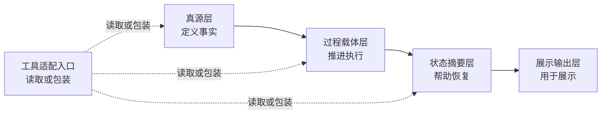

# files-driven

当前公开版本：`v0.5.0`<br>
未发布中的整理与修正见 [CHANGELOG.md](CHANGELOG.md) 的 `Unreleased`。

> `files-driven` 不再只回答“文档怎么分层”，而是先回答：能力归谁持有，项目事实归谁承载，哪些规则必须运行时直接生效，当前动作先走哪个关口。

这个仓库面向 AI、多代理和文档密集项目。
对“全员通过 AI 工具工作 + 项目级规则文件跟仓共享 + Git 目录级全量共享”的项目，
默认先把多人协作理解成共享存储问题，并把 `Skill` 看作能力主容器。
它关心的不是“文档多不多”，而是：

- 入口规则、能力规则、项目规则、项目实体谁应该先被看见
- 哪些内容属于 `Skill`，哪些属于项目实体
- 真源到底在哪里，哪些页面只是过程载体、状态摘要或展示投影
- 多人、多代理、多工具并行时谁先读、谁能写、谁负责复核
- 项目漂移以后如何止血、恢复和回退

## 统一真源

当前底层能力模型的唯一真源是 [docs/项目治理能力模型.md](docs/项目治理能力模型.md)。
`README.md`、`SKILL.md`、`PROJECT_STORIES_AND_TESTS.md`、`MIGRATION.md` 与 [schemas/README.md](schemas/README.md) 都只做入口、执行导览、迭代边界或合同说明，不与这份真源平行定义本体。

这里还要分清两条版本轴：

1. `v1 -> v2 -> v2.1` 说的是能力模型世界观的演进
2. governed pack / contract 侧仍有一条独立的 `contract tranche v1`

像 `checks.route / evidence / write / stop`、`subject_ref` 这类约束，默认属于后者。

## 当前治理模型演进口径

当前统一口径要按三段演进来记：

1. `v1`：先解决真源、投影、合同化和执行实例怎么分层落盘
2. `v2`：`files-driven = 项目总监`，明确谁是治理者、谁是工作对象
3. `v2.1`：在 `v2` 之上补 `作用域绑定与防变形规则`

三者是演进关系，不是互斥关系。完整定义见 [docs/项目治理能力模型.md](docs/项目治理能力模型.md)。

默认工作对象是：

- 项目里的作家 `Skill`、`Coder Skill` 和其他项目 `Skill`
- 这些 `Skill` 正在生产和维护的小说、软件、任务实例、状态页和展示页

默认先判三个作用域：

1. `capability_scope`
2. `project_scope`
3. `runtime_scope`

这里有一个硬约束：

- `入口规则 / 能力规则 / 项目规则 / 项目实体` 默认描述的是 `project_scope`
- `files-driven` 自己默认站在 `capability_scope` 发起治理
- 如果治理对象正好是 `files-driven` 自己，要显式声明 `self-hosting`

相关专题见 [作用域绑定与防变形规则](references/作用域绑定与防变形规则.md)。

## 这不是模板，而是方法学

`files-driven` 不是一个“推荐目录结构”，也不是某一种流程宗派的外壳。
它更接近一种项目治理的方法学语言，但现在先抓的是治理主语和动作关口：

- 什么必须成为入口规则
- 什么应该沉到 `Skill` 作为能力规则
- 什么只对当前项目成立，应该作为项目规则
- 什么是项目实体，承载事实、实例、状态和展示
- 哪个动作先判归属、再落盘、判不清就升级

所以它提供的不是一条固定答案，而是一套判断框架。
它教你的不是“这个项目应该长成哪一个样子”，
而是“面对不同项目、不同风险、不同协作形态时，应该怎样判断什么该稳定、什么该流动、什么该收紧、什么该保持轻量”。

换句话说，这个仓库更接近“渔”，不是“鱼”。

## 这套方法从哪里来

`files-driven` 不是从某一个单一理论直接搬来的。
它来自多年在不同理论和实践中的沉淀、碰撞和重组，
尤其吸收了下面几类传统：

| 来源 | 原本强调什么 | 在 `files-driven` 里的转写 |
| --- | --- | --- |
| `Spec-Driven` | 边界、规格、验收、慢变量 | 真源、对象边界、验收锚点、版本清晰度 |
| `Kanban` | 流动、可见性、在制品、交接 | 过程载体、状态摘要、恢复入口、队列与责任面 |
| `Agile / Sprint-like` | 反馈、阶段收敛、里程碑复核 | 决策包、复核关口、阶段性整合、回退与改进 |
| 系统论 | 结构、层次、边界、耦合 | 结构家族、四层分层、责任模型、慢快变量拆分 |
| 信息论 | 来源、传输、失真、压缩 | 真源、投影、读取顺序、版本锚点、恢复成本 |
| 控制论 | 观察、决策、执行、反馈、纠偏 | `observe -> decide -> act -> review -> rollback_or_improve` |

这几类传统在这里不是并列摆放的口号，而是被重新组织成一套统一语言。
`files-driven` 的目标，不是让项目“看起来像规格驱动”或“看起来像敏捷”，
而是回答一个更根本的问题：

**在一个由人、代理、工具、文档和流程共同组成的项目里，事实如何稳定，执行如何推进，失真如何被发现，秩序如何被恢复。**

## 与 Prompt / Context / Harness 演化线的关系

除了更早的项目治理传统，`files-driven` 也与近年的 AI 工程方法演化有关。
如果把这条外部演化线压缩来看，大致可以分成三步：

1. `Prompt Engineering`
   - 重点放在单次提示词怎么写、角色怎么设、示例怎么给
   - 主要优化的是单回合输出质量
2. `Context Engineering`
   - 重点转向上下文如何组织，包括检索、记忆、状态、工具入口和历史材料
   - 主要优化的是多回合、多步骤任务里的上下文供给质量
3. `Harness / Agent-Native Engineering`
   - 重点进一步转向代理运行底座，包括上下文装配、验证入口、恢复链、监督界面和回退机制
   - 主要优化的是代理在真实项目环境中的可控性、可恢复性和交付稳定性

`files-driven` 与这条演化线是相通的，但不是从它们直接派生出来的。
更准确地说，它是在多年项目实践和更早的治理理论基础上，
对这条演化线做出的本地重述：

- 当外界还在谈 `prompt` 时，它更关心提示词背后的事实真源和边界来源
- 当外界开始谈 `context` 时，它更关心上下文的结构、分层、读取顺序和失真成本
- 当外界开始谈 `harness` 时，它更关心把这些问题真正落到项目文档、过程载体、状态投影和控制回路里

所以这条演化线对本项目的意义，不是提供根源，
而是提供一个很好的参照系：
它帮助解释为什么今天的项目治理，已经不能只停留在“写好 prompt”或“堆好资料”，
而必须进一步回答代理怎么接手、怎么验证、怎么恢复、怎么被监督、怎么在多人多工具环境下保持同一套事实。

## 这套方法的原创重点在哪里

这套方法的重点不在发明新名词，而在把原本分散在不同理论里的治理要点，压成了可以直接落到仓库和协作中的判断语言。

它至少做了这几件事：

1. 把文档从“被动说明”提升为“治理载体”
2. 把项目材料稳定拆成结构家族，而不是只按目录名或文件外观理解
3. 把文档系统稳定拆成真源、过程、摘要、展示四层
4. 把多主体协作中的问题转写成信息流、责任边界和控制回路问题
5. 把 `Spec / Kanban / Agile` 从彼此竞争的标签，重组为可按项目特征组合的治理资源

所以 `files-driven` 不要求你先认同某个理论门派。
它要求的是：面对一个真实项目，能否把边界、事实、流动、反馈和恢复说清楚。

## 它在教什么判断

如果把这套方法再压缩一层，它主要在教五种判断：

1. 什么应该成为慢变量，进入稳定真源
2. 什么应该保持流动，留在过程载体
3. 什么只能总结，不能反写上游
4. 什么需要正式关口，什么保持轻量回路
5. 当项目开始漂移时，应该先止血哪里，再恢复哪里

这也是为什么它既能吸收规格驱动、看板流和敏捷节奏，
又不直接退化成其中任何一种固定模板。

## 什么时候该用

- 仓库里已经有不少规则页、任务页、状态页和入口文档，但它们开始互相漂移
- 你要让多人、多代理、多工具协作时还能共享同一套事实
- 你准备做治理，但不想一上来就堆很重的流程
- 你希望“继续开发”“开始审计”“推进”这类短口令能稳定跨工具复用
- 你需要一套能交接、能恢复、能回退的文档结构
- 你的项目反复出现“还没审完就想修改”“明明 `blocked` 了还继续往下走”这类 gate 失效

## 什么时候不该用

- 你只是在做一次性的小脚本或单人短任务
- 你现在只是想补一个简单 README，而不是治理一套协作结构
- 你的项目几乎没有状态页、过程页和工具入口，也没有明显恢复压力

## 它在解决什么问题

很多项目不是死在代码上，而是死在这些地方：

- README 因为最常被打开，慢慢变成真源
- 任务单或讨论页顺手改了规则，但没人回写上游
- 状态页为了方便接手，写出了上游没确认的新事实
- 工具入口各自包了一层口径，越包越不一致
- 人换了、代理换了、上下文断了以后，项目只能靠猜恢复
- 明明已经说了 `partial / blocked`，但下一步还是提前滑进修改、发布或放行

`files-driven` 的作用，就是先把这张责任图重新画清，再决定该启用哪些治理动作。
如果问题重心已经是 gate 不严，
仓库里现在也提供了一条专门的稳定解入口：
[references/关口硬化与稳定放行.md](references/关口硬化与稳定放行.md)。

## 理论基点

这套方法学在执行时，默认同时从三个基点看项目：

### 1. 系统基点

先判断边界、层次、结构家族、慢快变量和责任面。
也就是先回答“系统怎么分层”，再回答“目录怎么摆”。

### 2. 信息基点

再判断一个事实从哪里产生、如何传播、在哪里被压缩、在哪里被投影。
也就是先回答“信息怎么流动和失真”，再回答“文档怎么写得漂亮”。

### 3. 控制基点

最后判断谁观察、谁决策、谁执行、谁复核、谁能回退。
也就是先回答“秩序如何被维持和恢复”，再回答“流程叫什么名字”。

`files-driven` 的很多独特性，正是来自这三个基点的同时使用。
它不是先选一个流程名字，再去配文档；
而是先看系统、信息和控制问题，再反推出该用哪些治理动作。

## 核心模型

下面这段只是对 [docs/项目治理能力模型.md](docs/项目治理能力模型.md) 的入口摘要。
如果与其他文档口径冲突，以统一真源为准。

在 skill-driven 项目里，默认先判三个作用域：

1. `capability_scope`
2. `project_scope`
3. `runtime_scope`

然后再判新的第一判断轴：

1. `入口规则`
2. `能力规则`
3. `项目规则`
4. `项目实体`

一句话原则是：

**具体能力归 Skill，项目内容归实体。**

这里默认描述的是 `project_scope`。
只有当前作用域和顶层归属已经判清，才继续把文档系统按四层看清：



四层分别回答：

- 真源层：哪份材料在定义事实、规则、边界
- 过程载体层：哪份材料在推进任务、讨论、决策、复核、交接
- 状态摘要层：哪份材料在帮人快速恢复现场
- 展示输出层：哪份材料只负责说明、汇报或对外展示

如果需要和稳定键名精确对齐，这四层分别对应：

- `truth_source`
- `execution_object`
- `status_projection`
- `display_projection`

再往下，技能才会在八类结构家族里定位职责。
这些家族不删除，但已经降成二级观察标签。入口层默认只说中文主叫法：

- 规则与约束层
- 对象层
- 流程层
- 技能层
- 角色层
- 过程载体层
- 状态摘要层
- 展示输出层

只有在需要和 schema、JSON 或稳定键逐项对齐时，才补：

- `policy_or_rules`
- `object`
- `workflow`
- `skill`
- `agent`
- `execution_object`
- `status_projection`
- `display_projection`

详细判断规则见 [SKILL.md](SKILL.md)。
如果要处理 self-hosting、双重身份或跨作用域冲突，先读 [作用域绑定与防变形规则](references/作用域绑定与防变形规则.md)。

## 这个仓库里各文件负责什么

| 文件 | 主要读者 | 主要职责 |
| --- | --- | --- |
| [README.md](README.md) | 第一次接触这个项目的人 | 解释这是什么、什么时候该用、怎么开始 |
| [docs/项目治理能力模型.md](docs/项目治理能力模型.md) | 维护底层模型的人或审计者 | 作为 `v1 / v2 / v2.1` 的统一底层真源 |
| [docs/使用手册.md](docs/使用手册.md) | 已决定按这套方式工作的团队成员 | 从项目要解决的问题出发，说明问题为什么会出现、常见方式为什么不够，以及团队今天该怎么执行 |
| [PROJECT_STORIES_AND_TESTS.md](PROJECT_STORIES_AND_TESTS.md) | 会继续开发这个仓库的人或代理 | 直接写清本项目当前的具体用户故事、测试用例、非目标和验收责任人 |
| [SKILL.md](SKILL.md) | 会执行这个技能的代理 | 给出主流程、判断规则、边界约束和参考件路由 |
| [agents/openai.yaml](agents/openai.yaml) | 通过 Agent 使用这个 skill 的人或代理 | 作为 agent-facing 入口表面，固定显示名、简短定位和默认 prompt 路由 |
| [QUICKSTART.md](QUICKSTART.md) | 第一次搭建受控资产包的人 | 给出最小资产包形状、校验脚本（validator）用法和起步顺序 |
| [docs/files引擎脚手架工程.md](docs/files引擎脚手架工程.md) | 需要给下游项目安装 `files engine` 的人 | 说明修正后的需求、四层边界、脚手架缺口、质询与收敛决议 |
| [MIGRATION.md](MIGRATION.md) | 已有资产包的维护者 | 说明从旧约定迁到当前约定要改什么 |
| [references/](references/) | 需要深入某一专题的人或代理 | 承载输出约定、流程库、读取顺序、共享约定和专项判断 reference |
| [examples/](examples/) | 想先看一条完整样例的人或代理 | 承载 discussion 主路径、受控 workflow、运行观察晋升链和条件分支 example |
| [schemas/](schemas/) | 需要结构化合同草案的人或代理 | 承载控制语义的机读结构草案（schema） |
| [starters/minimal-files-engine/](starters/minimal-files-engine/) | 第一次从零安装 `files engine` 的人或代理 | 提供官方最小 starter、拓扑 manifest、注册表样例和项目 skill 骨架 |
| [scripts/bootstrap_files_engine_starter.py](scripts/bootstrap_files_engine_starter.py) / [scripts/validate_files_engine_scaffold.py](scripts/validate_files_engine_scaffold.py) | 需要冷启动或回归 starter 的人或代理 | 负责 starter 生成与 scaffold 校验 |
| [scripts/run_repo_treatment_rollout.py](scripts/run_repo_treatment_rollout.py) | 需要在 `self-hosting` 场景把仓库级收口方案编码成受控执行的人或代理 | 负责编排 repo treatment rollout、写 runtime artifact，并调度 `codex exec` 落地本轮推进 |
| [docs/](docs/) | 想看完整背景、版本说明和公开专题材料的人 | 承载说明书、版本说明、公开专题记录和当前阶段补完计划 |
| [CHANGELOG.md](CHANGELOG.md) | 关心仓库变更账本的人 | 记录仓库层面的新增、调整和删除 |

除 [docs/项目治理能力模型.md](docs/项目治理能力模型.md) 外，上面这些文件都不负责重定义底层能力模型本体。

一句话区分：

- `README` 是入口
- `SKILL` 是执行导览
- `agents/openai.yaml` 是 Agent 使用这个 skill 时的入口表面
- `QUICKSTART` 是最小上手
- `MIGRATION` 是迁移说明
- `references` 是按需下钻
- `examples` 是最短样例
- `schemas` 是结构化合同草案
- `starters` 是官方最小起点
- `bootstrap / scaffold validator` 是冷启动执行面
- `docs` 是背景与公开说明
- `CHANGELOG` 是账本

## 当前 files engine 脚手架资产

如果你要做的不是“继续维护本仓库”，而是“把 `files-driven` 装进一个下游项目”，
先不要把 `QUICKSTART` 当成总入口。

`files-driven` 作为 meta-skill 的首屏动作只保留四个：`install / register / repair / audit`。
其中 `install` 通过 [scripts/bootstrap_files_engine_starter.py](scripts/bootstrap_files_engine_starter.py) 完成，`register / repair / audit` 通过统一的 [scripts/manage_files_engine.py](scripts/manage_files_engine.py) 完成。
这里的 `audit` 当前默认只表示“基础体检”：
先检查 scaffold、registry、route 和 starter profile 这类脚手架资产是否闭环，
不直接冒充对下游项目的全量系统体检；`pack / runtime` 级体检仍属于下一 tranche。
本仓库本身是 `reference implementation + regression fixture`，不是通用模板本体。

当前官方脚手架主路径是：

1. 先读 [docs/files引擎脚手架工程.md](docs/files引擎脚手架工程.md)
2. 再用 bootstrap 起一个最小 starter
3. 检查 [starters/minimal-files-engine/](starters/minimal-files-engine/) 里的 `governance/hooks.policy.md`、`governance/scaffold.manifest.json`、`governance/files.registry.json`、`governance/intent.routes.json`、starter profile 线索和项目 `Skill` 骨架
4. 用统一的 [scripts/manage_files_engine.py](scripts/manage_files_engine.py) 完成 `register / repair / audit`
5. 先跑 [scripts/validate_files_engine_scaffold.py](scripts/validate_files_engine_scaffold.py)，再跑 [scripts/validate_governance_assets.py](scripts/validate_governance_assets.py)

这里要显式区分 4 层：

- `repo.files-driven`：本仓库自己的资产
- `skill.files-driven`：当前技能包本身
- `meta-skill capability`：帮下游项目安装 `files engine` 的能力
- `downstream project instance`：starter 生成出来的具体项目实例

`QUICKSTART.md` 继续只管 pack。
starter、registry、route 和 bootstrap 则属于 `meta-skill capability`。

starter 内部的默认级联顺序也要分开：

- `governance/scaffold.manifest.json` 只负责 starter 拓扑、required paths 和 tracked globs
- `governance/files.registry.json` 只负责文件身份核心与 annotations，不反向持有 `route_id`
- `governance/intent.routes.json` 单向消费注册过的 `file_id`，决定入口、必读和写入目标
- starter 专属形状约束不放进 manifest，应由单独的 starter profile 持有
- `install` 通过 [scripts/bootstrap_files_engine_starter.py](scripts/bootstrap_files_engine_starter.py) 播种 starter，`register / repair / audit` 通过 [scripts/manage_files_engine.py](scripts/manage_files_engine.py) 处理

因此：

- 只改 route 名称或入口动作时，只改 `intent.routes.json`
- 新增或移动 tracked 文件时，先改 `scaffold.manifest.json`，再改 `files.registry.json`，最后按需改 route
- 如果只是 starter 专属形状变化，先改 starter profile，再按需碰 validator，不要回写 manifest

如果当前要处理的是 `files-driven` 自己这套仓库资产，而不是某个下游 starter，
并且你已经完成一轮诊断、准备把收口方案编码成一次受控执行，
可直接使用 [scripts/run_repo_treatment_rollout.py](scripts/run_repo_treatment_rollout.py)。
这个 runner 负责生成 governed run pack、调度 `codex exec`，并把 `workflow.state.json / workflow.events.jsonl / status.projection.json` 的运行写权收回脚本侧。

## 当前受控资产包约定

如果你要落一个受控流程的项目资产包，入口层先记住这几件事：

- `BOUNDARY.md` 先锁首批场景、故事、测试、非目标、质量参考对象和验收责任人
- `workflow.contract.json` 是控制合同
- `objects/*.json` 是项目级对象合同
- `workflow.state.json` 与 `workflow.events.jsonl` 是运行实例
- 可选 `status.projection.json` 只做派生摘要
- workflow 顶层 `checks.route/evidence/write/stop` 是 v1 唯一检查注册面
- `agent_refs` 指向 `agent.contract.json` 的顶层 `agent_id`
- `approver_ref` 指向 `roles[].role_id`
- `workflow.events.jsonl.subject_ref` 在 v1 只指向 `node_id / transition_id`

如果你只是第一次接触这套做法，先把上面理解成：

- `BOUNDARY.md` 先回答“这个 pack 到底服务谁、交付什么、怎么才算没跑偏”
- `workflow.contract.json` 管流程怎么走
- `objects/*.json` 管状态、证据、输出、批准对象这些定义
- `workflow.state.json` 和 `workflow.events.jsonl` 记录这次运行到了哪里
- `status.projection.json` 只是帮助恢复现场的摘要页，不能偷偷放行

更细的键名和字段解释，放在 [QUICKSTART.md](QUICKSTART.md) 与 [schemas/README.md](schemas/README.md)。

这里再特别区分两层 `schemas` 语义：

- 仓库根 [schemas/](schemas/) 是结构草案目录
- 项目资产包里的对象合同不再放 `schemas/*.json`，而放 `objects/*.json`

校验脚本（validator）也按这个边界工作：

- 参数是一个 `pack_root`
- 它要求 `pack_root/BOUNDARY.md` 先把故事和测试锚点落成显式边界入口
- 它读取 `pack_root/workflow.contract.json`
- 它只把 `pack_root/objects/*.json` 当作 canonical pass path
- 只要 pack 里还保留 `pack_root/schemas/*.json`，validator 就会直接报迁移错误
- 它会对资产包文件执行真实结构校验；本地运行前先安装 [requirements-dev.txt](requirements-dev.txt)

如果运行中反复出现同类纠偏，不要直接把它们写回上游真源；先读 [references/运行观察与能力晋升.md](references/运行观察与能力晋升.md)，再按 [examples/capture-candidate-activation/README.md](examples/capture-candidate-activation/README.md) 的官方路径把信号停在 `运行观察 -> 证据包 -> 历史召回 -> 拆分出口 -> 候选试验 -> 激活或回退`。只有候选已经跨场景验证、试验通过且具备回退路径，才回到 [docs/项目治理能力模型.md](docs/项目治理能力模型.md) 判断是否允许晋升到能力真源。

当前仓库还附带两层最小验证面：

- [tests/](tests/) 提供校验脚本的最小回归测试
- [.github/workflows/governance-assets-ci.yml](.github/workflows/governance-assets-ci.yml) 把 smoke 资产包、JSON 语法和单元测试接进 CI

这里提到的“v1 唯一检查注册面”“v1 subject_ref 语义”，
默认都指 governed pack / contract 的 `tranche v1`，不是在回退世界观层的版本口径。

## 第一次怎么开始

无论你是什么场景，先用这 3 份建立共同口径：

1. [docs/项目治理能力模型.md](docs/项目治理能力模型.md)
2. [README.md](README.md)
3. [docs/使用手册.md](docs/使用手册.md)

如果你是要把这套 skill 给非工程背景读者或零基础使用者看，
不要一上来就让他们读完整模型、完整说明书或全部 reference。
先让他们读 [docs/非工程背景起步.md](docs/非工程背景起步.md)，
先只学会：

1. 哪份文件算数
2. 今天先做什么
3. 哪些文件先别改

如果还要继续往下钻，再按问题进入：

- 非工程背景读者先上手：读 [docs/非工程背景起步.md](docs/非工程背景起步.md)、[docs/使用手册.md](docs/使用手册.md)
- 团队培训：读 [references/AI-Native同构团队协作.md](references/AI-Native同构团队协作.md)、[QUICKSTART.md](QUICKSTART.md)
- 继续开发本仓库：读 [PROJECT_STORIES_AND_TESTS.md](PROJECT_STORIES_AND_TESTS.md)、[docs/当前阶段补完计划.md](docs/当前阶段补完计划.md)、[SKILL.md](SKILL.md)、[docs/完整说明书.md](docs/完整说明书.md)
- 为下游项目安装 `files engine`：读 [docs/files引擎脚手架工程.md](docs/files引擎脚手架工程.md)，再跑 [scripts/bootstrap_files_engine_starter.py](scripts/bootstrap_files_engine_starter.py)
- hooks 已经成为工具适配面的一部分：读 [references/hooks使用方法论与脚手架.md](references/hooks使用方法论与脚手架.md)、[references/工具适配对照表.md](references/工具适配对照表.md)、[references/关口硬化与稳定放行.md](references/关口硬化与稳定放行.md)
- 统一底层模型与 JSON 合同方向：读 [schemas/README.md](schemas/README.md)、[QUICKSTART.md](QUICKSTART.md)、[MIGRATION.md](MIGRATION.md)
- 手上已经有旧资产包：读 [MIGRATION.md](MIGRATION.md)、[examples/smoke-governed-review/BOUNDARY.md](examples/smoke-governed-review/BOUNDARY.md)、[examples/smoke-governed-review/WORKFLOW.md](examples/smoke-governed-review/WORKFLOW.md)

如果你已经确定要落地治理，继续按问题下钻：

- 边界还不稳：读 [references/起步阶段_故事与测试对齐.md](references/起步阶段_故事与测试对齐.md)、[references/说人话需求确认工具包.md](references/说人话需求确认工具包.md)
- 仓库已经漂移或需要恢复：读 [references/场景手册.md](references/场景手册.md)、[references/基本原则.md](references/基本原则.md)
- 议题还没到 `task / decision`，但已经不能只留在聊天里：读 [references/讨论收口与晋升.md](references/讨论收口与晋升.md)、[examples/discussion-decision-task/BOUNDARY.md](examples/discussion-decision-task/BOUNDARY.md)、[examples/discussion-decision-task/WORKFLOW.md](examples/discussion-decision-task/WORKFLOW.md)
- 议题争议很大，需要逐点质询后再收敛：读 [references/反方质询与收敛回路.md](references/反方质询与收敛回路.md)、[examples/adversarial-convergence/README.md](examples/adversarial-convergence/README.md)
- 运行中反复出现纠偏、又不能直接热改能力真源：先读 [references/运行观察与能力晋升.md](references/运行观察与能力晋升.md)，再看 [examples/capture-candidate-activation/README.md](examples/capture-candidate-activation/README.md) 和 [examples/capture-candidate-activation/WORKFLOW.md](examples/capture-candidate-activation/WORKFLOW.md)；如果还需要把它放回总模型，再回看 [references/经典治理流程库.md](references/经典治理流程库.md) 和 [docs/项目治理能力模型.md](docs/项目治理能力模型.md)
- 多工具过程已经不透明，需要统一接手面：读 [references/跨层共享约定.md](references/跨层共享约定.md)、[examples/multi-tool-process-projection/process-projection.md](examples/multi-tool-process-projection/process-projection.md)
- 全员通过 AI 工具工作，并在 Git 上目录级全量共享：读 [references/AI-Native同构团队协作.md](references/AI-Native同构团队协作.md)
- 只有复杂共享问题真的出现时，再读 [references/跨层共享约定.md](references/跨层共享约定.md)、[references/工具适配对照表.md](references/工具适配对照表.md)
- 需要同时处理工具全局 rules、项目级规则、局部 pack 规则和适配入口，并确保改动不漏：读 [references/多规则工具治理与精准修改协议.md](references/多规则工具治理与精准修改协议.md)
- 希望用短口令推进工作：读 [references/意图触发约定.md](references/意图触发约定.md)
- 需要正式输出治理方案：读 [references/输出约定.md](references/输出约定.md)

## 常见开口方式

第一次使用时，不必把整个仓库讲成论文。像下面这样开口就够了：

- “帮我判断这个仓库里哪些文件是真源，哪些只是状态摘要。”
- “这个项目已经开始漂移了，请先给我一个止血顺序。”
- “我要搭一个 AI Agent 驱动的新项目，先帮我锁方向与边界。”
- “这条议题还不适合进 task，请先帮我开 discussion，并判断什么时候该晋升。”
- “这条讨论争议已经很大，请按质询-答辩-收敛来帮我收口。”
- “运行里同类纠偏反复出现，但我不想直接热改能力真源，先帮我判断该停在记录、候选还是晋升。”
- “我们现在有多工具过程，但接手时看不清到底跑了什么，请补一个 process projection。”
- “我们要统一多个工具的全局 / 项目 / pack 级 rules，请先列出应改文件，再做完整修改。”
- “我们想用‘继续开发’和‘开始审计’这类短口令驱动工作，帮我做成稳定约定。”
- “我的目标读者几乎没有软件工程基础，先别讲理论，告诉我哪份文件算数、今天先做什么。”

## 阅读路线

如果你是代理并且要真正执行这个技能，默认顺序是：

1. [SKILL.md](SKILL.md)
2. [references/输出约定.md](references/输出约定.md)
3. 按当前问题去读对应 reference

如果你只想理解语言和写法标准，先读：

1. [docs/语言体系规范.md](docs/语言体系规范.md)
2. [references/说人话需求确认工具包.md](references/说人话需求确认工具包.md)

如果你只想先让非工程背景读者能开工，先读：

1. [docs/非工程背景起步.md](docs/非工程背景起步.md)
2. [docs/使用手册.md](docs/使用手册.md)

## 仓库结构

```text
.
├── README.md
├── SKILL.md
├── CHANGELOG.md
├── agents/
│   └── openai.yaml
├── docs/
│   ├── 完整说明书.md
│   ├── 使用手册.md
│   ├── 语言体系规范.md
│   └── v*_版本说明.md
└── references/
    ├── 输出约定.md
    ├── 经典治理流程库.md
    ├── 场景手册.md
    ├── 基本原则.md
    ├── 治理模式选择对照表.md
    ├── 结构家族定位约定.md
    ├── 官方读取顺序.md
    ├── 工具适配对照表.md
    ├── 跨层共享约定.md
    ├── 起步阶段_故事与测试对齐.md
    ├── 说人话需求确认工具包.md
    ├── 文档生命周期与压缩.md
    └── 意图触发约定.md
```

## 版本与变更

- 当前公开版本是 `v0.5.0`
- 未发布中的整理与修正统一记在 [CHANGELOG.md](CHANGELOG.md) 的 `Unreleased`
- 每一版为什么重要、改变了什么理解或用法，读 [docs/](docs/) 里的 `v*_版本说明.md`
- 研究过程留痕、任务计划、进度账本和内部案例默认留在本地忽略区，不进入公开仓库

## 贡献与安全

- 贡献方式见 [CONTRIBUTING.md](CONTRIBUTING.md)
- 安全问题见 [SECURITY.md](SECURITY.md)

## 许可证

当前许可证见 [LICENSE](LICENSE)，为 `MIT`。
