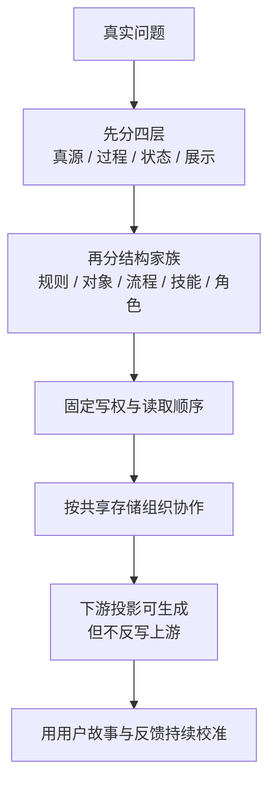
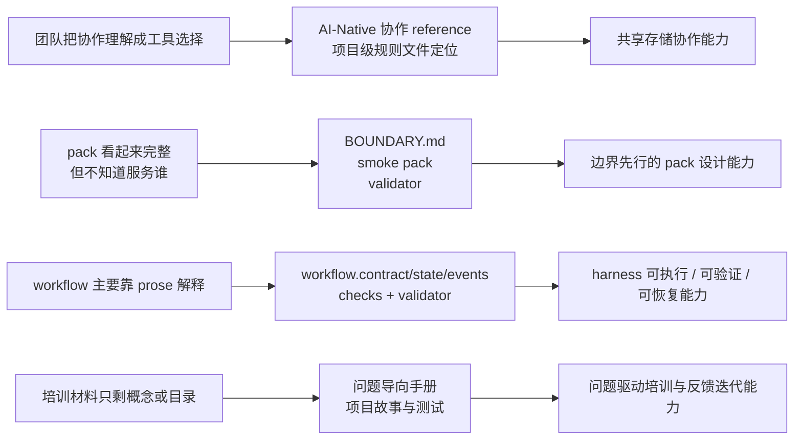

# Files-Driven 使用手册

这份手册回答 5 个问题：

1. 这个项目到底在解决什么问题
2. 这些问题为什么会出现
3. 常见解决方式为什么不够
4. `files-driven` 是怎么解的
5. 团队今天开始应该怎么按这套方式工作

默认前提是：

1. 团队已经决定按 `files-driven` 协作
2. 团队成员主要通过 AI 工具工作
3. Git 是共享底座
4. 项目级规则文件跟仓共享

## 1. 这个项目是为了解决什么问题而设计的

`files-driven` 不是为“文档整理”设计的。
它是为下面这类项目失真问题设计的：

1. 项目里没有人说得清哪份文件才是真源
2. docs、ppt、状态页、README 慢慢变成事实来源
3. 不同 AI 工具各自带一套口径，项目语义开始漂
4. 多个执行上下文并行工作，却没有明确写权边界
5. 交接严重依赖聊天回放，新接手者恢复成本很高
6. 明明已经生成很多材料，但仍然说不清“当前到底是什么状态”

一句话说，
这个项目解决的是：

**AI-Native 团队在共享存储上协作时，事实、过程、状态和展示容易混写、漂移和失控的问题。**

可以先把问题看成这条失真链：

这不是一个静态规范问题，
而是一个要持续对齐用户故事并通过正向反馈不断校准的问题。
也就是说：

1. 我们先看到真实问题
2. 再把问题压成用户故事和测试锚点
3. 再用文件结构和工作方式去承载这些故事
4. 再通过真实执行反馈继续修正

所以 `files-driven` 不是一次性定规矩，
而是一个“问题 -> 故事 -> 执行 -> 反馈 -> 再校准”的持续闭环。

## 2. 这些问题为什么会存在

这些问题不是因为团队不努力，
而是因为 AI-Native 协作天然会放大几个结构性问题。

### 2.1 执行上下文变多了

以前一个任务可能只有一个人改。
现在可能同时有：

- 一个人在两个工作站上工作
- 两个人各自开 AI 会话
- 一个主 agent 加多个并行子 agent

结果就是：

- 写入点变多
- 覆盖风险变高
- 恢复成本变高

### 2.2 生成能力太强了

AI 很容易快速生成：

- docs
- ppt
- 状态页
- 汇报稿
- 说明稿

生成变容易以后，
团队最容易犯的错不是“没材料”，
而是“材料太多，但不知道谁有真源写权”。

### 2.3 工具品牌容易掩盖项目事实

团队一旦开始大量使用 `Codex / Claude Code / AntiGravity`，
很容易把问题理解成：

- 谁在用哪个工具
- 哪个工具界面更方便
- 哪个工具有自己的 rules

但真正的问题其实是：

- 仓库里哪些规则文件是项目真源
- 这些规则文件和工具入口是什么关系

### 2.4 传统聊天式交接不够用了

当任务复杂度和并发度上来以后，
“看聊天记录恢复上下文”会越来越贵。

因为聊天能解释过程，
但不擅长稳定承载：

- 当前真源入口
- 当前版本锚点
- 当前卡点
- 当前可写边界

## 3. 常见解决方式为什么不够好

### 3.1 只靠 README

很多团队默认把 README 当总入口。
短期有效，长期问题很大：

1. README 最常被打开，所以最容易被顺手改成真源
2. README 同时承载介绍、状态、规则、教程时，很快会混层
3. README 适合入口说明，不适合长期承担全部治理职责

### 3.2 只靠聊天、issue、群消息

这些东西适合讨论，
不适合承担稳定真源。

原因很简单：

1. 它们天然是过程载体，不是真源层
2. 它们不适合做最短读取顺序
3. 它们不适合稳定承载版本锚点和写权边界

### 3.3 只靠工具自带 rules

如果项目事实主要活在某个工具自己的本地 rules 里，
会有两个问题：

1. 规则不跟仓，团队不能共享
2. 工具一切换，项目语义就漂

所以 `files-driven` 不反对工具 rules，
但反对**只有工具 rules，没有项目级共享规则文件**。

### 3.4 只靠目录规范

目录规范很重要，但不够。
因为目录只能告诉你“放在哪里”，
不能自动回答：

1. 谁能直接写
2. 哪个是当前版本锚点
3. 哪个只是摘要
4. 哪个只是展示

### 3.5 只上 CI/CD 或 workflow

自动化很有用，但它不能替代真源判断。
如果团队还没分清：

- 哪份文件定义事实
- 哪份文件只是展示

那自动化只会更快地放大混乱。

## 4. Files-Driven 是怎么解决这些问题的

`files-driven` 的解决方式不是“发明更多文件”，
而是先把项目里的材料按职责拆清。

解决路径可以压成这一张图：

### 4.1 先分四层

它先把所有材料分成四层：

1. 真源
2. 过程载体
3. 状态摘要
4. 展示输出

这一步解决的是：

- 哪些文件定义事实
- 哪些文件只是推进任务
- 哪些文件只是帮助恢复
- 哪些文件只是用来展示

### 4.2 再分结构家族

它再把关键结构分成：

1. 规则
2. 对象
3. 流程
4. 技能
5. 角色
6. 运行实例
7. 状态投影
8. 展示投影

这一步解决的是：

- 不同类型的文件到底在承担什么职责
- 为什么不能把 `AGENT.md`、`SKILL.md`、状态页、ppt 都混成一类

### 4.3 对 AI-Native 团队，先把协作改写成共享存储问题

在 `files-driven` 里，
对 AI-Native 同构团队，
默认先把协作理解成：

`多个执行上下文共享同一份 Git 存储`

这一步的好处是：

1. 把问题从“谁用哪个工具”拉回“哪些路径谁能写”
2. 把问题从“谁说得对”拉回“哪份真源有最终写权”
3. 把问题从“聊天记忆”拉回“仓库里的共享入口”

### 4.4 让下游投影可再生

`files-driven` 默认主张：

- docs 可生成
- ppt 可生成
- 状态页可生成
- handoff 可生成

但它们都不该长期脱离上游独立演化。

这一步解决的是：

- 为什么团队生成物很多，却仍然容易失真
- 为什么 AI 越能写，越需要先稳住真源

### 4.5 用用户故事和反馈把方法钉回真实问题

`files-driven` 不希望团队把治理做成抽象制度。
它默认要求你不断回到两个东西：

1. 当前真实用户故事
2. 当前真实测试或验收锚点

这样做的原因是：

1. 如果没有故事，治理很容易变成抽象框架堆叠
2. 如果没有测试锚点，团队很难知道当前修正是不是在解决真实问题
3. 如果没有反馈迭代，文档结构会再次脱离实际工作方式

所以这套方法天然匹配：

- 用户故事
- 测试锚点
- 正向反馈迭代

它不是额外附着在 `files-driven` 外面，
而是它能长期不漂的前提。

### 4.6 最近几个版本不是在补材料，而是在补能力

最近几轮迭代如果只按“新增了哪些文件”去看，
很容易误读成材料变多了。

但如果按真实问题去看，
它们其实在补 4 类能力：

1. 让 AI-Native 团队先按共享存储，而不是按工具品牌理解协作
2. 让 governed pack 先有边界入口，再谈合同链
3. 让 `workflow` 能被 harness、validator 和恢复链稳定消费
4. 让培训和 onboarding 能直接围绕真实问题、用户故事和测试锚点展开

这也是为什么项目级故事文档里会出现 `US-4` 到 `US-7`。
它们不是附会出来的说明文字，
而是在把最近版本的能力升级重新钉回真实用户问题。

## 5. 具体问题怎么展开理解

### 5.1 问题一：真源漂移

最常见症状：

1. README 最后变成了规则来源
2. 某个状态页写得比上游更及时
3. 讨论里顺手定了规则，但没回写

`files-driven` 的处理方式：

1. 先判谁是真源
2. 再判谁只是摘要或展示
3. 固定读取顺序
4. 固定版本锚点

### 5.2 问题二：工具入口冒充项目规则

最常见症状：

1. 工具切换后，大家理解项目方式突然不同
2. 本地 rules 和仓库规则互相打架
3. 工具品牌名慢慢变成角色名

`files-driven` 的处理方式：

1. 区分 runtime / 工具入口 与 项目级规则文件
2. 明确项目级 `AGENT.md / CLAUDE.md / CODEX.md / SKILL.md / RULES.md` 的真源地位
3. 让工具入口回指真源，而不是自带一套项目语义

### 5.3 问题三：docs、ppt、状态页反向定义事实

最常见症状：

1. ppt 已经改了，但上游没改
2. docs 写了新的承诺，但规则里没有
3. 状态页偷偷放行了下一步

`files-driven` 的处理方式：

1. 把这些材料明确归到下游投影
2. 允许生成、允许刷新、允许短期热修
3. 但禁止长期脱离上游真源独立演化

### 5.4 问题四：多人并行互相覆盖

最常见症状：

1. 两个人同时改同一块真源
2. 多个 agent 并行，但没有隔离
3. 合流时只能靠口头解释

`files-driven` 的处理方式：

1. 先按路径分工
2. 并行时用 branch / worktree / 独立会话隔离
3. 合流时以上游真源裁决

### 5.5 问题五：交接只能靠聊天回放

最常见症状：

1. 新接手的人先翻聊天记录
2. 看了很久仍然不知道先读什么
3. 明白发生过什么，但不知道现在该做什么

`files-driven` 的处理方式：

1. 交接只压最少必要入口
2. 强制说明真源入口、当前状态、当前卡点和下一步
3. 尽量避免让聊天回放承担恢复职责

### 5.6 问题六：团队把协作误解成工具选择

最常见症状：

1. 讨论一直停在“哪个 AI 工具更好用”
2. 项目级规则文件被当成某个工具的包装文案
3. 团队没人说得清哪些路径才是真正共享面

`files-driven` 的处理方式：

1. 先区分 runtime / 工具入口 与 项目级规则真源
2. 默认把协作改写成共享存储问题
3. 让项目级规则文件跟仓共享，并成为统一读取入口

### 5.7 问题七：pack 看起来完整，但没有边界入口

最常见症状：

1. pack 里已经有合同文件，但说不清服务谁
2. 只有 schema 和状态文件，没有显式场景和失败边界
3. 看起来很完整，但新接手的人不知道从哪里判断是否越界

`files-driven` 的处理方式：

1. 先用 `BOUNDARY.md` 锁定场景、故事、测试和失败边界
2. 再补 `workflow.contract.json`、对象合同和其他最小结构资产
3. 用 smoke pack 和 validator 守住最小边界入口

### 5.8 问题八：`workflow` 只会解释，harness 读不稳

最常见症状：

1. `workflow` 主要靠 Markdown 或口头说明来解释
2. runtime 要靠猜状态、猜关口、猜下一步
3. 检查、恢复和自动化执行依赖额外聊天补充

`files-driven` 的处理方式：

1. 把 `workflow.contract.json` 固定成控制语义真源
2. 把 `workflow.state.json` 和 `workflow.events.jsonl` 固定成实例层
3. 把 `checks` 与 validator 接成最小可执行合同链
4. 用“减少运行时歧义、稳定检查、降低恢复成本、提升 harness 可消费性”评估这类改动，而不是只看文件数量

## 6. 团队今天开始怎么用

### 6.1 新项目第一天

先做这 5 件事：

1. 约定共享仓库
2. 约定哪些项目级规则文件跟仓共享
3. 约定哪些路径谁能直接写
4. 约定并行时用什么隔离
5. 约定最小交接格式

然后立刻补一层校准：

1. 当前最重要的 1 到 3 个用户故事是什么
2. 当前最重要的 3 到 8 个测试或验收锚点是什么
3. 至少哪个失败或越界边界必须显式写出来

如果这一步没有做，
团队后面的结构治理很容易重新漂回“看起来很完整，但没有对准真实问题”。

不要第一天先做：

1. 大量目录设计
2. 长篇 docs
3. 复杂 workflow 合同
4. 大量展示页

只有当你已经遇到下面这些问题，
再补更重的 `workflow`、实例状态和检查链：

1. harness 或 validator 需要稳定读取控制语义
2. 任务需要跨会话恢复，而不是一次性完成
3. 项目已经有明确 gate、证据和 stop 条件
4. 团队已经出现“说明能看懂，但机器和接手者都读不稳”的症状

### 6.2 一次任务开始前

任何执行者或 AI 代理开工前，都先回答：

1. 这次任务的目标是什么
2. 这次任务的真源在哪里
3. 当前版本锚点在哪里
4. 这轮可写边界是什么
5. 这轮改完后要刷新哪些下游投影

还要再补两个判断：

1. 这次任务对应的是哪个用户故事
2. 这次任务完成后，要让哪个测试锚点变得更稳

如果一个改动既对不上当前问题，也对不上当前故事和测试，
默认就要怀疑它是不是范围外动作。

### 6.3 执行时

默认顺序：

1. 先改上游真源
2. 再补运行状态
3. 最后刷新 docs、ppt、状态页、汇报页

### 6.4 完成前

至少复核：

1. 有没有越过真源直接改投影
2. 有没有让状态摘要越权
3. 有没有让工具包装文案冒充项目规则
4. 有没有留下难以恢复的断点

## 7. 团队操作纪律

团队协作时，默认遵守下面这些纪律：

1. 不用工具品牌名命名长期角色
2. 不让 README 长期兼任全部真源
3. 不让 docs、ppt、状态页长期独立演化
4. 不让交接主要依赖聊天记录
5. 不让并行工作在同一写入面无隔离进行
6. 不让治理结构脱离当前用户故事和测试锚点长期自转

## 8. 培训时应该怎么讲

如果你今天要做培训，
建议不要从概念表开始讲，
而是按问题链讲：

### 第一段：项目到底在解决什么问题

讲 3 件事：

1. 真源为什么会漂
2. 为什么 AI 生成越强，越容易把投影写成真源
3. 为什么协作的主问题其实是共享存储和写权，而不是工具品牌

### 第二段：这些问题怎么和用户故事、反馈迭代挂上钩

讲 3 件事：

1. 每个治理问题都要能回到真实用户故事
2. 每个关键修正都要有测试或验收锚点
3. 每轮反馈都要能推动真源、过程或投影的再次校准

### 第三段：别的方式为什么不够

讲 4 件事：

1. 只靠 README 不够
2. 只靠聊天不够
3. 只靠工具 rules 不够
4. 只靠目录规范不够

### 第四段：我们怎么解决

讲 4 件事：

1. 四层分离
2. 结构家族分离
3. AI-Native 团队先按共享存储理解协作
4. 下游投影默认可再生

可以直接拿最近几轮版本举例：

1. `AI-Native 同构团队协作` 解决“团队把协作理解成工具选择”
2. `BOUNDARY.md + smoke pack + validator` 解决“pack 只有合同，没有边界入口”
3. `workflow.contract/state/events + checks` 解决“workflow 只能解释，harness 读不稳”
4. [PROJECT_STORIES_AND_TESTS](/Users/jixiaokang/.agents/skills/files-driven/PROJECT_STORIES_AND_TESTS.md) 和这份手册一起解决“培训和迭代脱离真实问题”

### 第五段：团队今天怎么执行

最后再讲操作层：

1. 新项目怎么起步
2. 一次任务怎么推进
3. 多人并行怎么分工
4. 交接怎么写

## 9. 如果培训后大家只记住一句话

就记住：

**我们共享的不是聊天，也不是工具界面；我们共享的是同一套仓库里的项目事实。**

## 10. 继续往下读什么

### 想看完整背景

- [README](/Users/jixiaokang/.agents/skills/files-driven/README.md)
- [完整说明书](完整说明书.md)
- [PROJECT_STORIES_AND_TESTS](/Users/jixiaokang/.agents/skills/files-driven/PROJECT_STORIES_AND_TESTS.md)

### 想直接执行这个 skill

- [SKILL](/Users/jixiaokang/.agents/skills/files-driven/SKILL.md)
- [输出约定](/Users/jixiaokang/.agents/skills/files-driven/references/输出约定.md)

### 想专门讲 AI-Native 团队协作

- [AI-Native 同构团队协作](/Users/jixiaokang/.agents/skills/files-driven/references/AI-Native同构团队协作.md)
- [工具适配对照表](/Users/jixiaokang/.agents/skills/files-driven/references/工具适配对照表.md)

### 想搭 governed pack

- [QUICKSTART](/Users/jixiaokang/.agents/skills/files-driven/QUICKSTART.md)
- [项目治理能力模型 v1](/Users/jixiaokang/.agents/skills/files-driven/docs/项目治理能力模型_v1.md)
